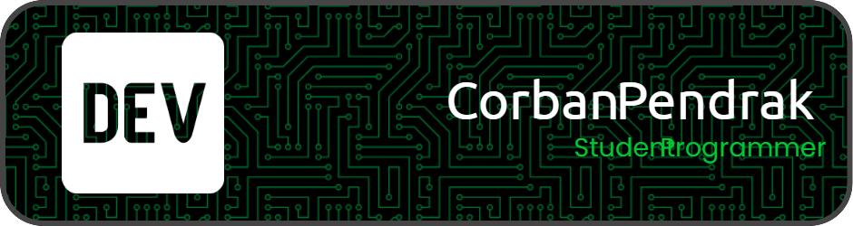

- 👋 Hello! I am @CorbanPendrak, a student programmer.
- 📖 I’m interested in a variety of topics not limited to the digital world, but am especially fascinated by natural language processing (NLP) transformers, web development, docker, and raspberry pi robots.  
- 🤔 In computer programming, I am currently learning about everything interesting I can find, from how GitHub actions work to using Bettercap in practice.
- 📝 I hope to soon learn more about machine learning genetic algorithms, a new language like 🐿️Go or 🦀Rust, and advanced penetration testing with HackTheBox.
- 🤝 I’m looking to collaborate on every project that seems interesting and can use my limited knowledge, since the idea of editing another person's code seems so novel.
- ✏️ Because of my lack of experience, I am mostly collaborating with documentation projects, as well as building my skills through personal projects.
