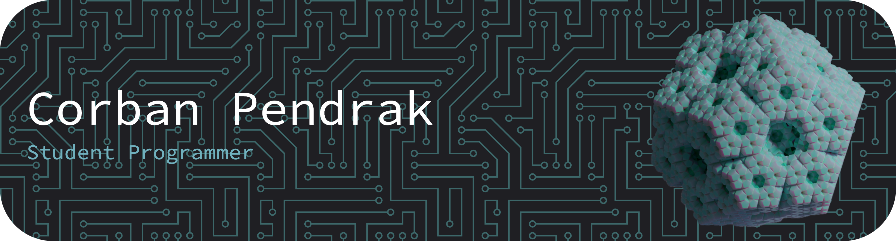

  
  <table>
    <tr>
      <td>
        
      </td>
      <td>
        

          📚 To find out what I am learning, checkout <a href="https://roadmap.sh/u/corbanpendrak">Roadmap.sh</a> 
          🛠️ To find out what I am working on, checkout <a href="https://github.com/CorbanPendrak">GitHub</a>  
          😎 To find out more about me, checkout <a href="https://corbanpendrak.github.io">my website</a>
        

      </td>
    </tr>
  </table>

